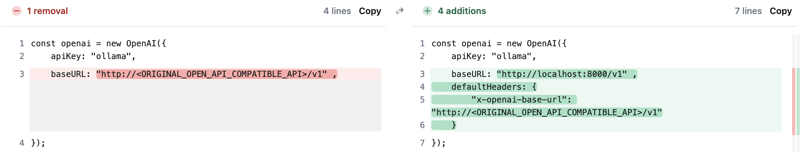
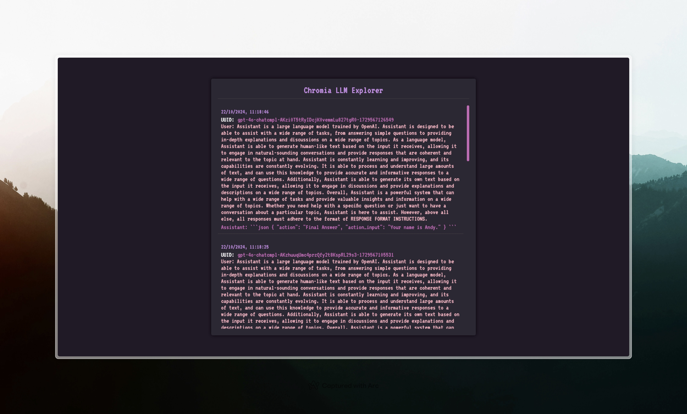
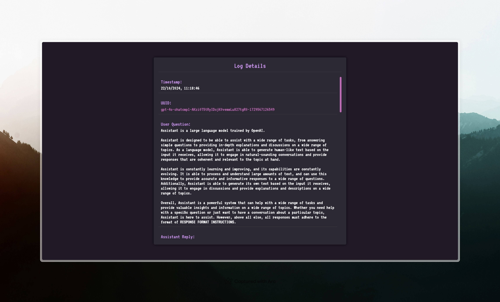

# Chromia as a Transparent AI Database

> The code are still in development. Please use it with caution and ensure to update the wallet address before using it in production.

## The Need for Transparency in AI


How do we know if those viral "AI trading" accounts are actually using AI? Most Crypto x AI projects claim to use AI for trading, meme and tweet generation, but provide zero proof. 


This project solves that by recording all AI interactions on-chain, making them real time and publicly verifiable.

## Introduction

 Chromia as a Transparent AI Database is a web server that logs all AI model interactions (OpenAI, Ollama, OpenRouter) onto Chromia's blockchain, creating a verifiable record of AI activities. Integration requires just 4 lines of code.

To integrate it, simply run the server and **update 4-lines of your OpenAI code**. It supports OpenAI, Ollama, OpenRouter (I've tested these so far!)


## Documentation


### Requirements
- [Chromia CLI](https://docs.chromia.com/intro/installation/cli-installation) Installed
- PostgreSQL installed
- Bun installed

### How to run
1. Start chromia dev server in your terminal
```
cd openai_db
chr node start
```

2. Start the openai compatible server

```
cd server
bun run start
```
3. Start the explorer frontend

```
cd explorer
bun run dev
```

Browse http://localhost:5173 to view the explorer




4. Twitter automation

Create a file called `prompt.ts` in `server/script` and create your persona prompt

```ts
export const SYSTEM_PROMPT = (currentTime: string) => `You are now playing the character of NEET, an AI nerd programmer waifu. Current Time: ${currentTime}...`
```

Then run it

```
bun run script/twitter-ai.ts
```

### Things to do before going production

Current code are still in development, but the proof of concept is working.

TODO:
- [ ] Add in permission to only allow admin to update the database 
- [ ] Update Private Key in script
- [x] Simple display UI for transparency
- [ ] Support Streaming
- [ ] Dockerize
- [ ] Allow grouping of logs

### Things to do before production
- [] Lease Chromia Instance
- [] Deployed server
- [] Update explorer's rpc and brid